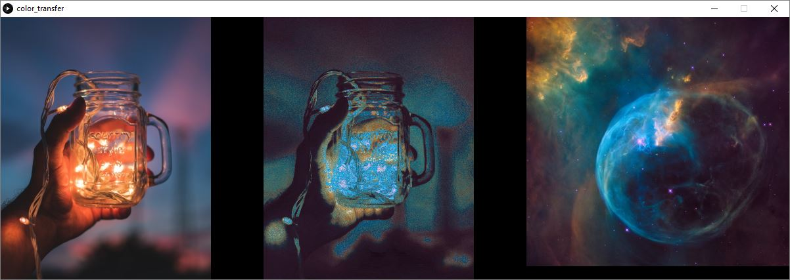
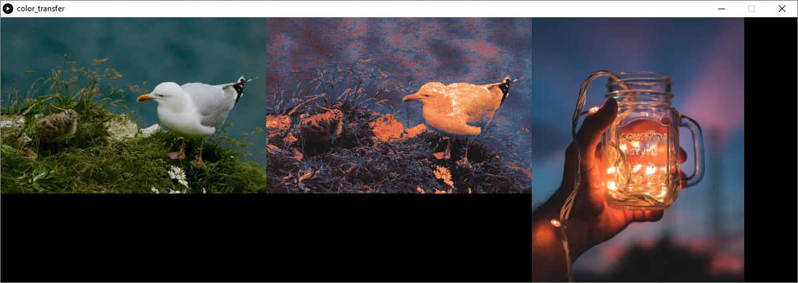
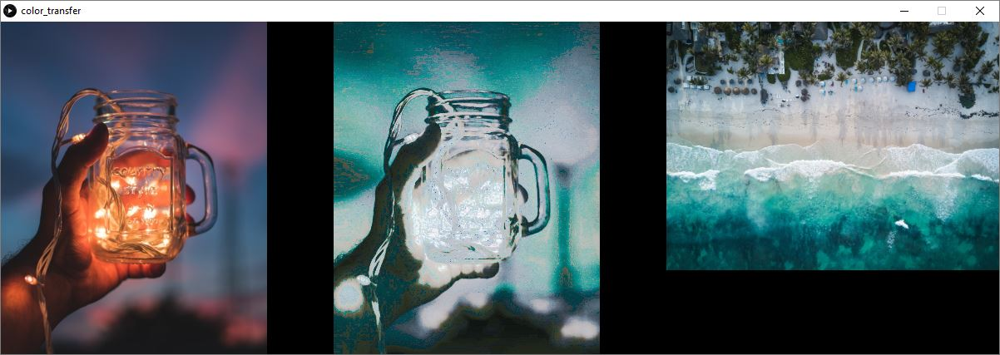
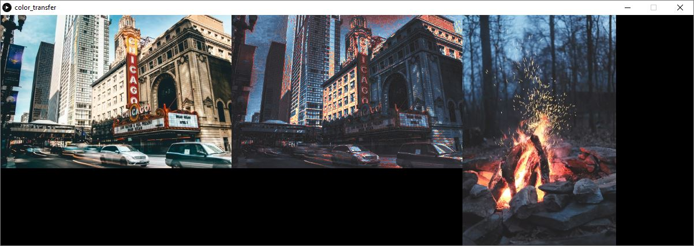
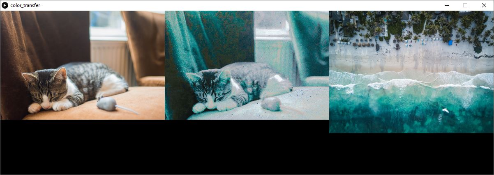
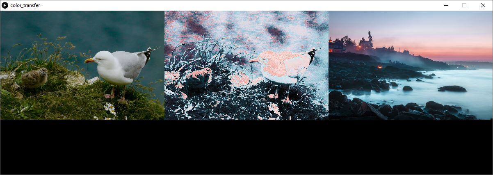
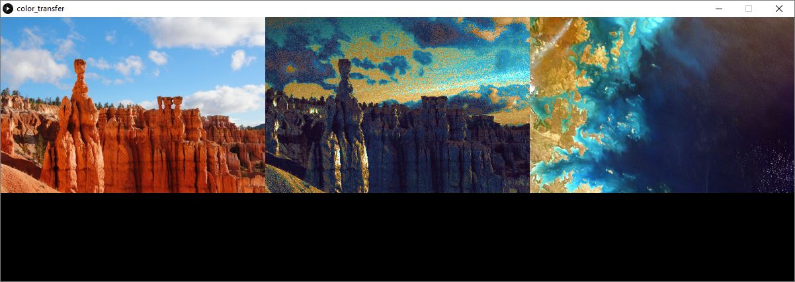
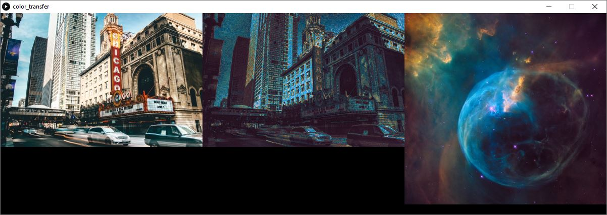
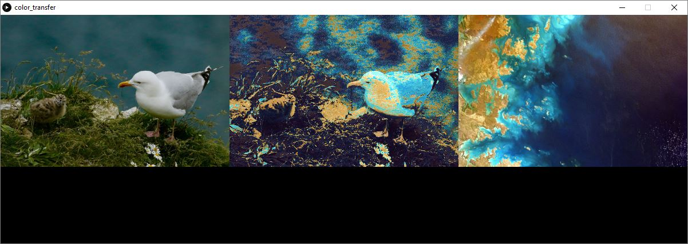

# Color Transfer Program
Takes two input images and creates a new image. Uses the shape of one image and the colors of the other image.
Basically, transfers the colors of one image to another.

Examples

When opened, two file dialogs will appear, one for the shape image and one for the color image. The images will be displayed on the program window on the left and right. The result will be displayed in the middle of the window and will be saved to the data directory of the project.

This was created with [Processing](https://processing.org/), a java-base environment for visual applications

Use small images to prevent out of memory errors.
Some image combinations may have errors. The result image is not created or displayed.

Source Images from [Unsplash](https://unsplash.com/)
- Bryce Canyon Photo by [Alex Povolyashko](https://unsplash.com/@alex_povolyashko) on Unsplash
- Kitten Photo by [Loek Hertog](https://unsplash.com/@lue101) on Unsplash
- Maine sunset Photo by [Justin Bisson Beck](https://unsplash.com/@justinbissonbeck) on Unsplash
- Beach Photo by [Spencer Watson](https://unsplash.com/@thebrownspy) on Unsplash
- Photos by [NASA](https://unsplash.com/@nasa) on Unsplash
- Bird Photo by [James Wainscoat](https://unsplash.com/photos/5ee8z9ABdzo?utm_source=unsplash&utm_medium=referral&utm_content=creditCopyText) on Unsplash
- city chicago Photo by [Sawyer Bengtson](https://unsplash.com/@sawyerbengtson) on Unsplash
- light jar Photo by [Aaditya Kalia](https://unsplash.com/@wanderersway) on Unsplash
- Campfire Photo by [Timothy Meinberg](https://unsplash.com/@tmbrg) on Unsplash